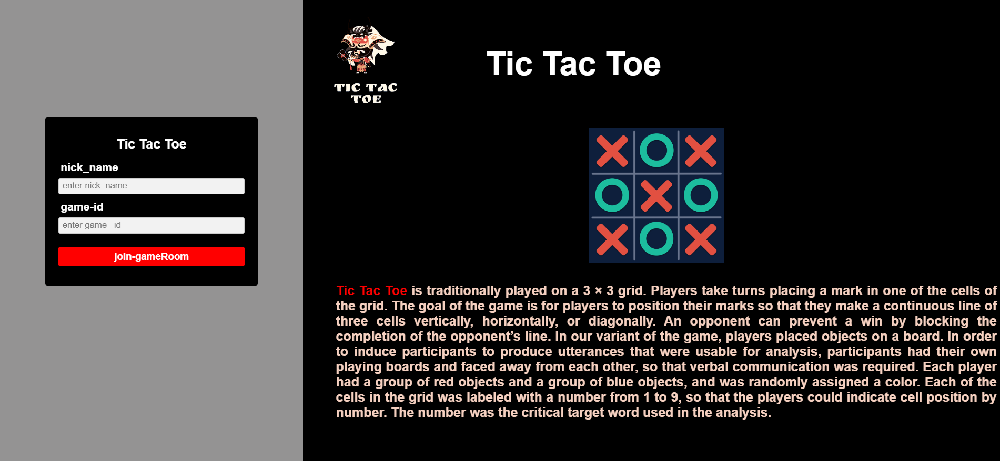
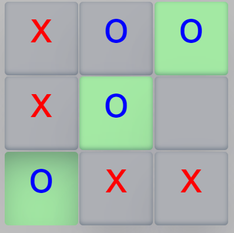
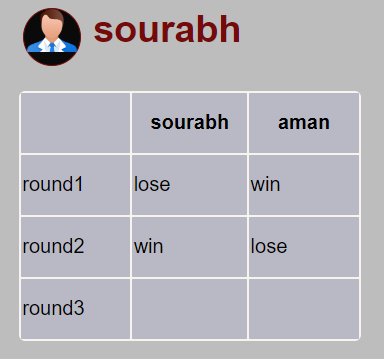
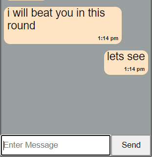

<h1 align="center">TIC TAC TOE</h1>
Tic Tac Toe is a two-player game in which the objective is to take turns and mark the correct spaces in a 3x3 (or larger) grid. Think on your feet but also be careful, as the first player who places three of their marks in a horizontal, vertical or diagonal row wins the game!

- <h4>API we are using is https://tictactoe-5oet.onrender.com/</h4>

<h2>User interface</h2>
- <h3>login page</h3>

- <h3>join to game page</h3> 
 
 
 - if user joined to a room with random room ID, user will redirected to game page
 - if there is two player in a room, then only user can play the game
 

  
this is the game board

  
 

 
 

  
if the player winn it will show in the leaderboard section

   
 

 
 

  
user can also chat with each other

    
 

 
 
 

